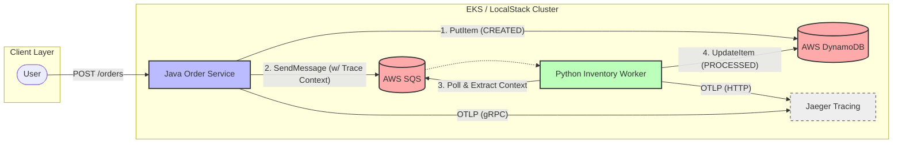

# Polyglot Ecommerce Platform (Java/Python/AWS)


**A reference architecture for high-throughput, event-driven systems on AWS.**

## 🏗️ Architecture
This system demonstrates the **Transactional Outbox Pattern** (simulated) and **Distributed Tracing** across language boundaries.



## 🚀 Key Features
* **Polyglot Microservices:** Spring Boot 3 (Java 17) for high-concurrency ingestion; Python 3.10 for flexible background processing.
* **Event-Driven:** Decoupled architecture using **AWS SQS** for asynchronous communication.
* **End-to-End Observability:** Implements **OpenTelemetry** to trace requests from the Java API, through the SQS Queue, to the Python Worker.
    * *See [ADR-001](docs/adr/001-observability-strategy.md) for context propagation strategy.*
* **Infrastructure as Code:** Fully reproducible local environment using **LocalStack** and Docker Compose.

## 🛠️ Tech Stack
* **Compute:** Java 17 (Spring Boot), Python 3.10 (Boto3)
* **Data:** AWS DynamoDB, AWS SQS
* **Observability:** OpenTelemetry, Jaeger
* **DevOps:** Docker, LocalStack

## 🏃‍♂️ Quick Start

### 1. Infrastructure
```bash
docker-compose up -d
# Waits for LocalStack (SQS/DynamoDB) and Jaeger to initialize